

    

    
Rekasa Perangkat Lunak

    
Paralel 1

    
.

    
.

    
<b>Kelompok 14</b>

    

        <ul>
            <li>Asmi Devi Azizah G64190009 - Data Administrator</li>
            <li>Muhammad Ikhsan Ananda G64190032 - Full-stack Developer</li>
            <li>Ramadhanti Nisa Permanahadi G64190092 - Front-end Developer</li>
        </ul>
    

    
.

    
.

    
Asisten Praktikum

    
Ali Naufal Ammarullah | Muhammad Fauzan Ramadhan | Levina

# User Story

  <table>
      <tr>
    <th>User</th>
    <th>Fitur yang diinginkan dan alasan</th> 
  </tr>
  <tr>
    <td>Pembaca awam</td>
    <td>Saya ingin bisa meliput berita sendiri dan dibaca oleh banyak orang, supaya orang lain tahu kejadian di sekitar saya yang menurut saya penting.</td> 
  </tr>
  <tr>
    <td>Pembaca yang suka menulis berita</td>
    <td>Saya ingin dapat membaca berita sesuai kategori topik, karena saya hanya ingin mmebaca berita dengan topik yang saya minati.</td> 
  </tr>
  <tr>
    <td>Jurnalis</td>
    <td>Jika saya harus menerima berita dari orang lain, saya tidak ingin ada berita bohong yang tembus ke media untuk menjaga reputasi lembaga pers tempat saya bekerja.</td> 
  </tr>
  </table>

# User Analysis

  

# Use Case Diagram

    

# Activity Diagram

    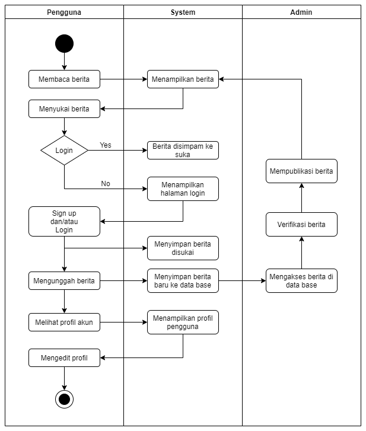

# Class Diagram

    

# Entity Relationship Diagram

    

# Arsitektur sistem

    

# Fungsi utama
## 1. Sign-up & Sign-in
Fitur Sign-up & Sign-in berfungsi bagi pengguna yang ingin mengunggah dan menyukai sebuah berita.

    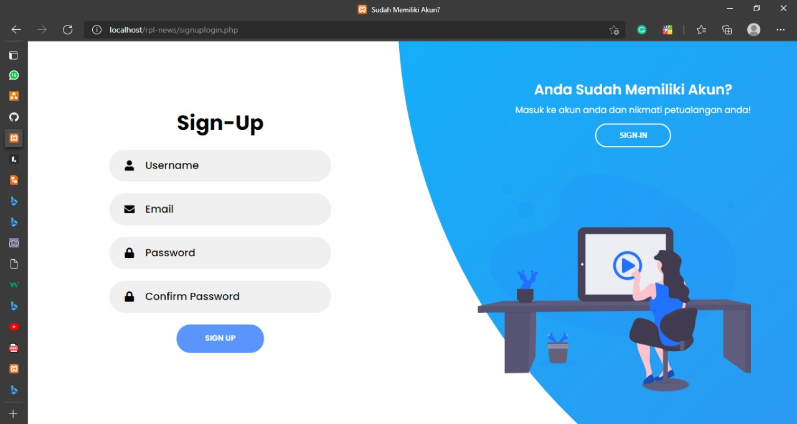

    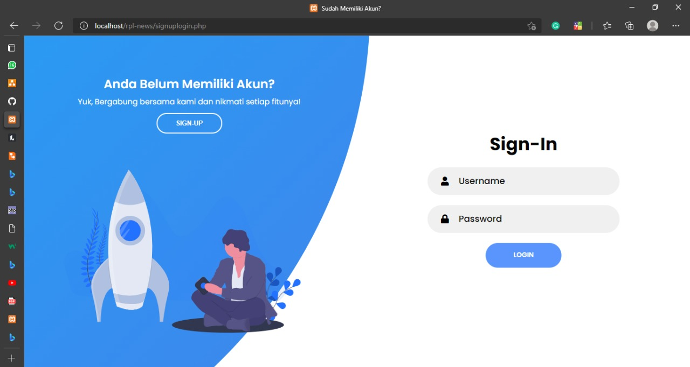

## 2. Homepage
Halaman ini dapat diakses oleh pengguna yang sudah melakukan Sign-up dan/atau Sign-in maupun belum. Disini sistem menampilkan berita dari berbagai kategori yang tersedia.

    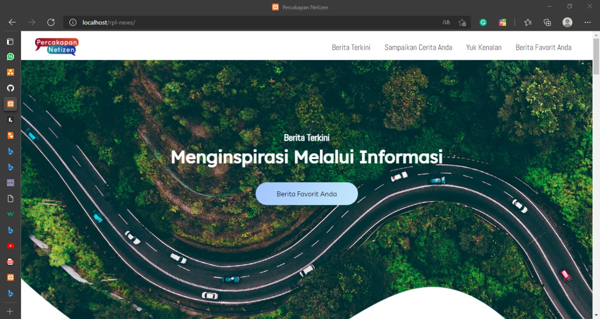

    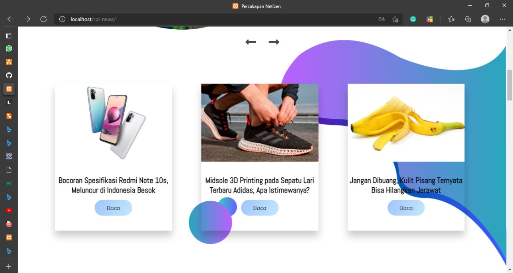

    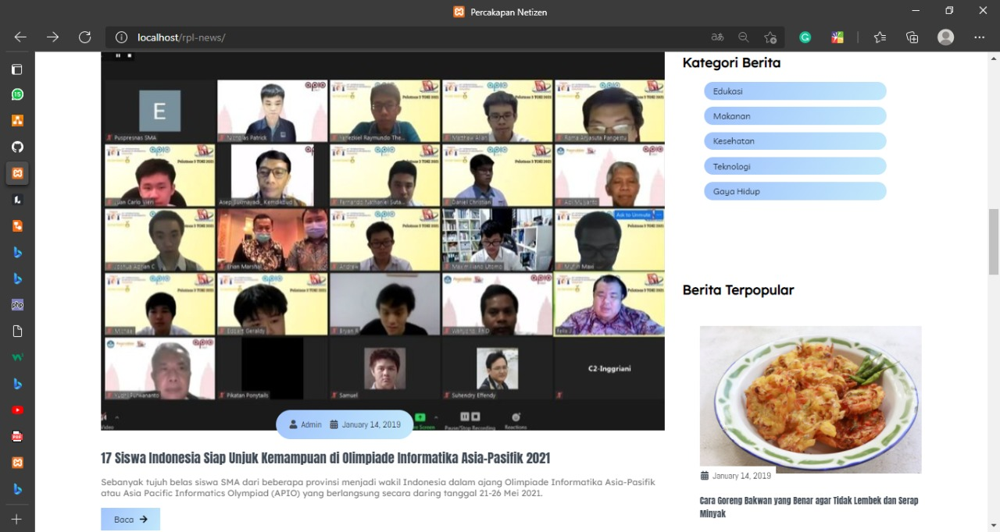

## 3. Mainpage
Halaman ini menampilkan berita yang akan dibaca oleh pengguna.

    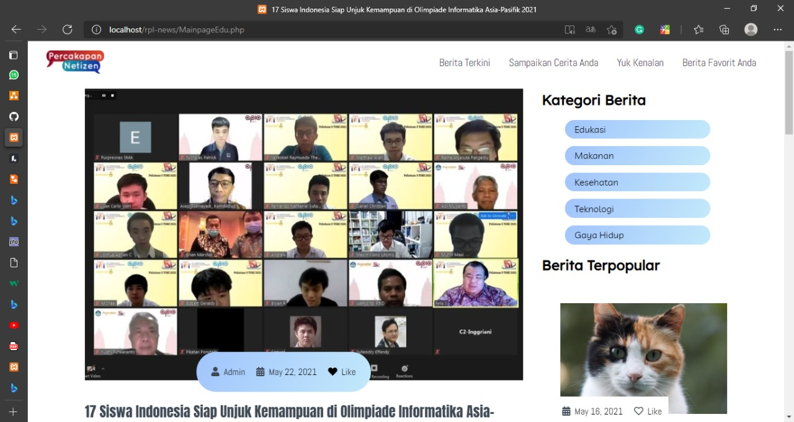

    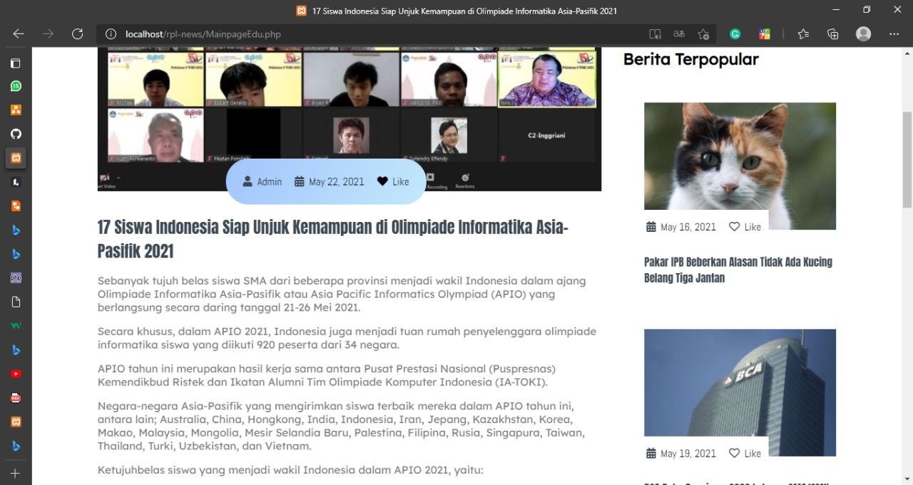

## 4. Profil
Pada halaman ini sistem akan menampilkan info tentang pengguna yang sudah Sign-in. Berita yang pengguna upload atau sukai akan terlihat di halaman ini. PEngguna juga dapat menghapus suatu berita dari list list dengan meklik button unlike.

    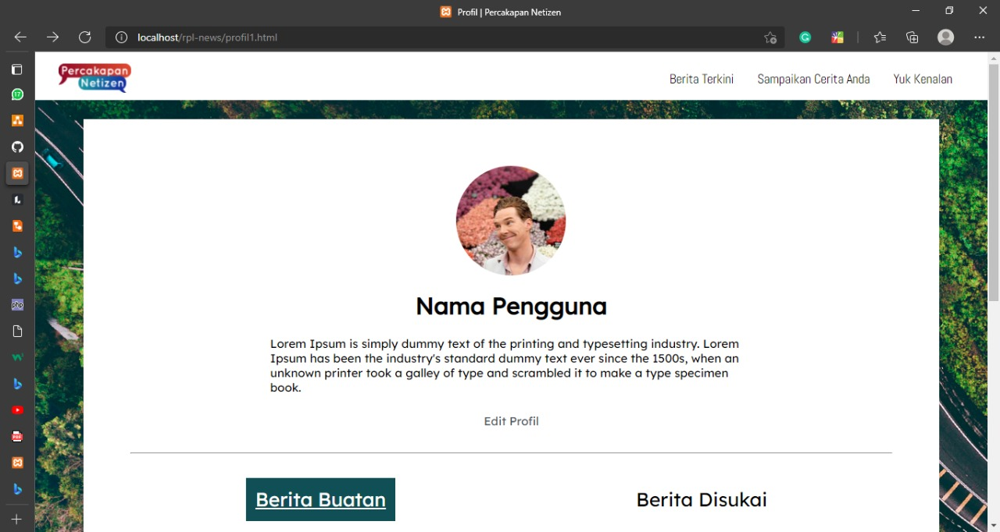

## 5. Edit profil
Pengguna yang ingin memperbaharui info diri pada halaman profil dapat melakukan edit roofil.

    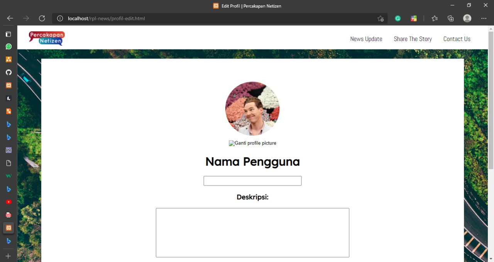

## 6. Unggah berita
Fitur Unggah berita difungsikan untuk pengguna yang inginmenggunggah sebuah berita. Fitur ini akan menyimpan berita yang diunggah pengguna ke database admin. Apabila lolos verifikasi makan berita tersebut akan diunggah oleh admin.

    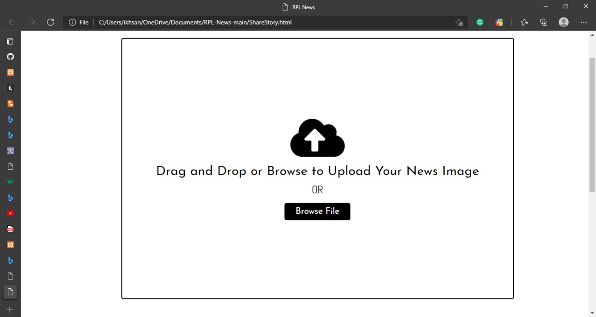

# Fungsi CRUD

    

<b>1. Create</b>

Fungsi ini memungkinkan pengguna untuk daftar anggota, sign-up dan sign-in, unggah berita

<b>2. Read</b>

# Latar Belakang
Rasa keingintahuan manusia terhadap informasi menjadikan media sebagai satu
kebutuhan penting dalam masyarakat. Media cetak maupun online, memegang peran penting
dalam kehidupan. Keinginan masyarakat untuk mengakses berita dengan cepat dan akurat
menjadikan media online sebagai pilihan utama. Kemajuan dunia digital sangat mendukung
perkembangan media yang menyajikan berita online, baik melalui aplikasi ataupun web.
Indonesia terdiri dari daerah-daerah dengan berbagai macam hal terjadi setiap waktunya. Sebuah
kejadian yang terjadi di suatu daerah di Indonesia dapat diketahui oleh daerah lain melalui
unggahan online dari saksi mata. Tidak sedikit masyarakat Indonesia yang memiliki kebiasaan
mengabadikan kejadian dan mengunggahnya ke media. Kebiasaan ini dapat difasilitasi melalui
web app yang memiliki fitur membaca dan mengunggah berita secara online. Kehadiran web
app dengan konsep tersebut juga dapat mendukung minat masyarakat untuk membaca dan
menulis berita. Hal ini dapat meningkatkan tingkat literasi masyarakat sehingga mendorong
kesadaran masyarakat terkait pentingnya nilai validitas suatu informasi.

# Tujuan
1. Memfasilitasi masyarakat untuk mengunggah kejadian di suatu daerah.
2. Mendukung masyarakat untuk kemudahan akses berita dari berbagai daerah.
3. Menyeleksi berita yang beredar untuk meminimalisir penyebaran berita hoax.
4. Meningkatkan minat baca dan menulis masyarakat.
5. Meningkatkan literasi dan kesadaran masyarakat terhadap validitas informasi.

# Saran untuk pengembangan selanjutnya
Web aplikasi ini bisa lebih berkembang jika dibuatkan versi aplikasinya juga, karena gawai smartphone lebih mudah dijangkau dibandingkan PC. Selain itu, ada banyak fitur interaktivitas masih bisa dikembangkan, following, dan algoritme untuk kurasi bacaan pengguna.
