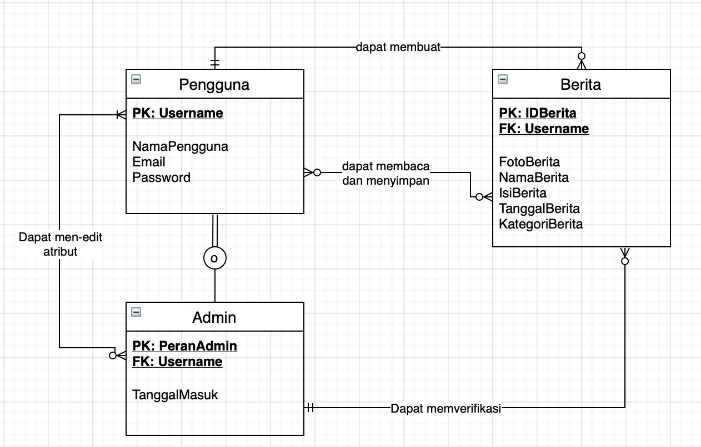

    

    
Rekasa Perangkat Lunak

    
Paralel 1

    
.

    
.

    
<b>Kelompok 14</b>

    

        <ul>
            <li>Asmi Devi Azizah G64190009 - Data Administrator</li>
            <li>Muhammad Ikhsan Ananda G64190032 - Full-stack Developer</li>
            <li>Ramadhanti Nisa Permanahadi G64190092 - Front-end Developer</li>
        </ul>
    

    
.

    
.

    
Asisten Praktikum

    
Ali Naufal Ammarullah | Muhammad Fauzan Ramadhan | Levina

# Deskripsi
Percakapan Netizen adalah web baca berita yang menyajikan berita dengan pilihan kategori menarik. Web ini memfasilitasi pengguna yang ingin mengunggah sebuah berita yang terjadi didaerah yang bersangkutan. Admin akan memverifikasi dan membulikasi berita yang sesuai dengan kriteria seleksi.

# Latar Belakang
Rasa keingintahuan manusia terhadap informasi menjadikan media sebagai satu
kebutuhan penting dalam masyarakat. Media cetak maupun online, memegang peran penting
dalam kehidupan. Keinginan masyarakat untuk mengakses berita dengan cepat dan akurat
menjadikan media online sebagai pilihan utama. Kemajuan dunia digital sangat mendukung
perkembangan media yang menyajikan berita online, baik melalui aplikasi ataupun web.
Indonesia terdiri dari daerah-daerah dengan berbagai macam hal terjadi setiap waktunya. Sebuah
kejadian yang terjadi di suatu daerah di Indonesia dapat diketahui oleh daerah lain melalui
unggahan online dari saksi mata. Tidak sedikit masyarakat Indonesia yang memiliki kebiasaan
mengabadikan kejadian dan mengunggahnya ke media. Kebiasaan ini dapat difasilitasi melalui
web app yang memiliki fitur membaca dan mengunggah berita secara online. Kehadiran web
app dengan konsep tersebut juga dapat mendukung minat masyarakat untuk membaca dan
menulis berita. Hal ini dapat meningkatkan tingkat literasi masyarakat sehingga mendorong
kesadaran masyarakat terkait pentingnya nilai validitas suatu informasi.

# Tujuan
1. Memfasilitasi masyarakat untuk mengunggah kejadian di suatu daerah.
2. Mendukung masyarakat untuk kemudahan akses berita dari berbagai daerah.
3. Menyeleksi berita yang beredar untuk meminimalisir penyebaran berita hoax.
4. Meningkatkan minat baca dan menulis masyarakat.
5. Meningkatkan literasi dan kesadaran masyarakat terhadap validitas informasi.

# User Analysis

  

# User Story

  <table>
      <tr>
    <th>User</th>
    <th>Fitur yang diinginkan dan alasan</th> 
  </tr>
  <tr>
    <td>Pembaca awam</td>
    <td>Saya ingin bisa meliput berita sendiri dan dibaca oleh banyak orang, supaya orang lain tahu kejadian di sekitar saya yang menurut saya penting.</td> 
  </tr>
  <tr>
    <td>Pembaca yang suka menulis berita</td>
    <td>Saya ingin dapat membaca berita sesuai kategori topik, karena saya hanya ingin mmebaca berita dengan topik yang saya minati.</td> 
  </tr>
  <tr>
    <td>Jurnalis</td>
    <td>Jika saya harus menerima berita dari orang lain, saya tidak ingin ada berita bohong yang tembus ke media untuk menjaga reputasi lembaga pers tempat saya bekerja.</td> 
  </tr>
  </table>

# Spesifikasi Teknis Lingkungan Pengembangan
<b>Software</b>
<ul>
    <li>Operating System (OS)</li>
    <ul>
        <li>Windows 10</li></ul>
    <li>Text Editor</li>
    <ul>
        <li>Ms Visual Studio Code</li></ul>
    <li>UI/UX Design</li>
    <ul>
        <li>Gimp</li></ul>
</ul>

<b>Hardware</b>
<ul>
    <li>Notebook PC HP 245 G7</li>
    <ul>
        <li>AMD Ryzen 3</li>
        <li>RAM 8 GB</li>
        <li>AMD Radeon Vega 3 Mobile Graphics</li></ul>
    <li>MacBook Catalina</li>
    <ul>
        <li>Dual-Core Intel Core M</li>
        <li>RAM 8 GB</li>
        <li>Intel HD Graphics 5300 1536 MB</li></ul>
    <li>Laptop Acer Aspire A514-51K</li>
    <ul>
        <li>Intel CORE i3</li>
        <li>RAM 4 GB</li>
        <li>Intel HD Graphics 620</li></ul>
</ul>

<b>Tech Stack</b>
<ul>
    <li>Front-end</li>
    <ul>
        <li>HTML</li>
        <li>CSS</li>
        <li>JS</li></ul>
    <li>Back-end</li>
    <ul>
        <li>PHP</li></ul>
    <li>Server</li>
    <ul>
        <li>Apache</li></ul>
    <li>Database</li>
    <ul>
        <li>PostgreSQL</li></ul>
</ul>

# Hasil dan Pembahasan
## Use Case Diagram

    

## Activity Diagram

    

## Class Diagram

    

## Entity Relationship Diagram

    

## Arsitektur sistem

    

## Fungsi Utama & Implementasi

<b>1. Sign-up & Sign-in, </b>
Fitur Sign-up & Sign-in berfungsi bagi pengguna yang ingin mengunggah dan menyukai sebuah berita.

    

    

<b>2. Homepage, </b>
Halaman ini dapat diakses oleh pengguna yang sudah melakukan Sign-up dan/atau Sign-in maupun belum. Disini sistem menampilkan berita dari berbagai kategori yang tersedia.

    

    

    

<b>3. Mainpage, </b>
Halaman ini menampilkan berita yang akan dibaca oleh pengguna.

    

    

<b>4. Profil, </b>
Pada halaman ini sistem akan menampilkan info tentang pengguna yang sudah Sign-in. Berita yang pengguna upload atau sukai akan terlihat di halaman ini. PEngguna juga dapat menghapus suatu berita dari list list dengan meklik button unlike.

    

<b>5. Edit profil, </b>
Pengguna yang ingin memperbaharui info diri pada halaman profil dapat melakukan edit roofil.

    

<b>6. Unggah berita, </b>
Fitur Unggah berita difungsikan untuk pengguna yang inginmenggunggah sebuah berita. Fitur ini akan menyimpan berita yang diunggah pengguna ke database admin. Apabila lolos verifikasi makan berita tersebut akan diunggah oleh admin.

    

## Fungsi CRUD

    

<b>1. Create, </b>
Fungsi ini memungkinkan pengguna untuk daftar anggota, sign-up dan sign-in, unggah berita

<b>2. Read, </b>
Fungsi ini memungkinkan pengguna untuk sign-up, sign-in, dan baca berita.

<b>3. Update, </b>
Fungsi ini memungkinkan pengguna untuk mengubah profil, menambahkan berita yang diupload dan berita yang disukai.

<b>4. Delete, </b>
Fungsi ini memungkinkan pengguna untuk menghapus berita yang telah disukai dengan memanfaatkan tombol unlike.

# Lampiran
<ul>
    <li><a href="https://trello.com/invite/b/fRMg3J0a/06716d922d02e309056cff7f39932b7f/projek-rpl">Trello</a></li>
    <li><a href="https://sites.google.com/apps.ipb.ac.id/pnetizen/home">G-Site</a></li>
    <li><a href="https://docs.google.com/presentation/d/1daYIpnMCqqqY4EIjPdM8t600DOVHrzyRt1Q9OlGwyBY/edit?usp=sharing">Slide</a></li>
</ul>

# Testing Test case (TC)
<b>Positive cases</b>
<ul>
    <li>Daftar akun :</li>
    
berhasil -> masuk ke halaman login

    <li>Masuk akun :</li>
    
berhasil -> masuk ke halaman save berita

    <li>Sampaikan berita :</li>
    
input file dan gambar pada fitur sampaikan berita 

    
berhasil -> peringatan berita berhasil di unggah dan segera di verifikasi

    <li>Update profile :</li>
    
berhasil -> masuk ke halaman simpan berita

</ul>
<b>Negative cases</b>
<ul>
    <li>Daftar akun :</li>
    
sandi konfirmasi tidak sama -> kembali di halaman daftar

    
email tidak valid -> kembali di halaman daftar

    <li>Login :</li>
    
username atau sandi tidak valid -> tetap di halaman login

    <li>Sampaikan berita :</li>
    
file tidak sesuai -> peringatan format file tidak didukung

    
file terlalu besar -> peringatan ukuran file terlalu besar

</ul>

# Saran untuk pengembangan selanjutnya
Web aplikasi ini bisa lebih berkembang jika dibuatkan versi aplikasinya juga, karena gawai smartphone lebih mudah dijangkau dibandingkan PC. Selain itu, ada banyak fitur interaktivitas masih bisa dikembangkan, following, dan algoritme untuk kurasi bacaan pengguna.
